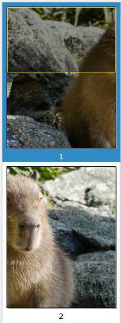

# halve-pdf.sh
A shell script to split your your pdf's pages into two (horizontally)

Requires `pdfinfo`, `pdfcrop`, `pdftk`, `bc`, `grep`, `awk`

## Usage
`halve-pdf.sh input_filename output_filename`  
`output_filename` is optional. Without it the program will write to `out.input_filename`

## Example
Before:  

After:  

